# PTE Core Describe Image：38 题统一模板与口语参考答案

> 汇总本地原有 YNWAC 的 27 道 DI 题，并核对 [PTE Core Practice 的 36 题题库](https://ptecorepractice.com/practice/describe-image)。跨题库比对后，跳过 25 道完全重复或高度相似题，补入 11 道新题，共 38 道不同题目。每题含题图、图像要点与按统一框架改写的英文参考答案；新站题图保存在同一图片目录，文件编号为 PTE_DI_28–38。

## 一、统一作答框架

这套框架面向 **PTE Core 的高分作答**：先让听者知道图片主题，再概括最明显的规律，最后用少量数据或位置细节支撑。按 Pearson 的考试说明，Describe Image 有 **25 秒准备、40 秒作答**；内容可依次从整体主题、主要信息、细节说到结论。准备时记关键词即可，不要背与图片不相关的整段文字。

### 1. 固定主框架

记住句子顺序，现场只填图片内容。大约七成是固定句型，三成是根据题图选择的主题、趋势和细节：

> The image provides information about [TOPIC].  
> Overall, it is clear that [MAIN FEATURE].  
> Looking at the details, [DETAIL 1].  
> In addition, [DETAIL 2].  
> Meanwhile / By contrast, [DETAIL 3].  
> Overall, the image clearly shows [SUMMARY].

内容顺序：**主题 → 总览 → 细节 1 → 细节 2 → 对比/细节 3 → 总结**。不必每题机械地说满六句：若图片信息简单，可缩短；若是流程图或组合图，可按图型调整中间句。

### 2. 25 秒准备：只写五个提示词

草稿板可用 **T – M – H – L – O**，只写单词、箭头和关键数字，不写完整句子：

| 提示 | 要找什么 | 例子 |
|---|---|---|
| **T — Topic** | 图片主题、对象、时间/地点 | sales, four countries |
| **M — Main feature** | 总体趋势或最明显的规律 | overall ↑, mostly stable |
| **H — Highest / strongest** | 最高值、最大类别、最突出部分 | Canada 80 |
| **L — Lowest / contrast** | 最低值或明显反差 | UK 25 |
| **O — Other detail** | 第二个有用的数据、阶段或位置 | US 65 |

如果图里没有高低数据，就把 H / L 换成最关键的两个步骤、地点或可见细节。优先选能说明主旨的信息，不要试图记下每一个数字。

### 3. 按题型选中间句

#### 柱状图 Bar Chart

先找最高与最低，再选一个居中的代表数据；不要逐条念完所有柱子。

> The bar chart provides information about [TOPIC].  
> Overall, [A] has the highest figure, while [B] has the lowest.  
> Looking at the details, [A] stands at approximately [NUMBER], followed by [C] at around [NUMBER].  
> By contrast, [B] records only about [NUMBER].  
> Overall, the chart shows noticeable differences among these categories.

常用表达：*has the highest / lowest figure; is the second highest; stands at approximately…; is significantly higher than…; the two figures are quite similar; there is a noticeable difference*。

#### 折线图 Line Graph

先判断整体是上升、下降、稳定还是波动，再选起点、终点、峰值或转折点。

> The line graph illustrates changes in [TOPIC] from [START YEAR] to [END YEAR].  
> Overall, [A] shows an upward trend, while [B] [declines / remains relatively stable].  
> At the beginning of the period, [A] stood at approximately [NUMBER].  
> It then [increased steadily / fluctuated] and reached around [NUMBER] by [YEAR].  
> Meanwhile, [B] [KEY CHANGE].  
> Overall, the most noticeable feature is [MAIN CHANGE].

够用的趋势词：上升 *increase / rise / grow*；下降 *decrease / fall / decline*；其他 *remain stable, fluctuate, reach a peak of…, hit a low of…*。优先选自己能说准确的词，不必为了显得高级而冒险。

#### 饼图 Pie Chart

说最大份额、次大份额和最小份额，突出比例关系。

> The pie chart shows the distribution of [TOPIC].  
> Overall, [A] accounts for the largest proportion, whereas [B] represents the smallest share.  
> Looking at the details, [A] makes up approximately [NUMBER] percent of the total.  
> This is followed by [C], at around [NUMBER] percent.  
> In contrast, [B] accounts for only about [NUMBER] percent.  
> Overall, [A] is clearly the dominant category.

比例表达选一种说顺即可：*accounts for 35 percent; makes up 35 percent of the total; represents 35 percent*。

#### 表格 Table

把表格当作分类数据来讲：主题、最突出特征、最高值、另一项有用数据、最低值。

> The table provides information about [TOPIC] across several categories.  
> Overall, it is clear that [MAIN FEATURE].  
> [A] records the highest figure, at approximately [NUMBER].  
> This is followed by [B], at around [NUMBER].  
> In contrast, [C] has the lowest figure, at about [NUMBER].  
> Overall, there are clear differences among the categories.

表格不需要逐行逐列朗读；挑能代表总体规律的数据即可。

#### 流程图 Process / Diagram

先交代起点、终点，再按顺序讲关键阶段；看不清某一步时，用中性过渡句继续。

> The diagram illustrates the process of [TOPIC].  
> Overall, it consists of several stages, beginning with [FIRST STAGE] and ending with [FINAL STAGE].  
> First, [STEP 1].  
> Next, [STEP 2].  
> After that, [STEP 3].  
> Finally, [FINAL STEP].  
> Overall, the diagram shows how [PRODUCT / RESULT] is [MADE / PREPARED / COMPLETED].

顺序连接词：*First → Next → After that → Finally*。某一步不确定时可说 *The material then moves to the next stage* 或 *This is followed by another stage*，不要停下来硬猜。

#### 地图 Map / 平面图 Floor Plan

先说地点或总体分布，再用方位说明主要对象的位置。

> The map shows the distribution / location of [TOPIC] in [AREA].  
> Overall, most of [OBJECTS] are concentrated in [AREA / PART].  
> [A] can mainly be found in the northern / southern / eastern / western part of the area.  
> Meanwhile, [B] is located mainly in [PLACE].  
> There are also [OTHER FEATURES] around [LOCATION].  
> Overall, the map shows a clear geographical distribution / layout of [TOPIC].

方位词：*in the north / south / east / west; in the centre; in the northeastern part; along the coast; near; around; between; on the left / right*。

#### 普通图片 / 场景图

不要套用最高值或趋势；描述主体、可见动作，以及前景和背景。

> The image shows a scene of [TOPIC].  
> The main focus of the image is [PERSON / OBJECT].  
> In the foreground, I can see [DETAIL].  
> In the background, there is / are [DETAIL].  
> On the left / right side, [VISIBLE ACTION OR OBJECT].  
> Overall, the image appears to show [GENERAL SCENE].

对不确定的动作或场景，用 *appears to* / *seems to*，例如 *He appears to be running*。只描述图中可见内容，不推断看不出来的背景故事。

#### 两张图 / 组合图

先说明两张图分别展示什么，再各说一个关键规律；不必把两张图的每个数字都讲完。

> The image contains two charts showing information about [TOPIC].  
> The first chart shows [CONTENT 1], while the second provides information about [CONTENT 2].  
> Overall, the most noticeable feature is [MAIN FEATURE].  
> In the first chart, [KEY DETAIL 1].  
> Meanwhile, the second chart shows that [KEY DETAIL 2].  
> Overall, the two charts provide a clear comparison of [TOPIC].

### 4. 数字模糊时的安全表达

能读清就准确说；看不清时用近似值或比例表达，不要为了报精确数字而卡顿，也不要编造图上没有的信息。

| 图上数值 / 情况 | 可用表达 |
|---|---|
| 37.8% | *approximately 38 percent* |
| 48 | *approximately 50* |
| 52 | *just over 50* |
| 47 | *just under 50* |
| 98 | *nearly 100* |
| 33% | *around one third* |
| 24% | *approximately one quarter* |
| 51% | *about half* |

通用缓冲词：*about, around, approximately, just over, just under, nearly*。

### 5. 作答时的执行要点

- 准备结束后尽快开口；先说主题和总览，保证答案一开始就切题。
- 用两到三个有代表性的细节支撑主旨，避免堆砌数字或逐项报表。
- 说错后直接继续，保持自然语速和音量；不要停下来重来。
- 图片很简单时可以少说一句；信息较多时先保住整体规律和最重要的对比。
- 练习时可用 **25 秒看图 + 30–38 秒作答**，重点练快速开口、近似数字表达和说错后继续。

Pearson 对 Describe Image 的作答时间、组织方式与口语表现建议，见[官方 Speaking & Writing 说明](https://www.pearsonpte.com/pte-core/test-format/speaking-writing/)。

## 二、38 题与统一模板参考答案

### 01. 制作咖啡的步骤

**图像要点：** 六格流程插图：倒热水、加入速溶咖啡、加糖和奶精、搅拌，最后饮用。

**口语参考答案**

> The image provides information about how to make a cup of instant coffee. Overall, it is clear that the process has a few simple steps, from adding ingredients to drinking the finished beverage. Looking at the details, hot water and instant coffee are first added to a cup. In addition, sugar and creamer are stirred in. Finally, a woman drinks the coffee. Overall, the pictures show a straightforward preparation process.

### 02. 美国人口增长最快的十座城市

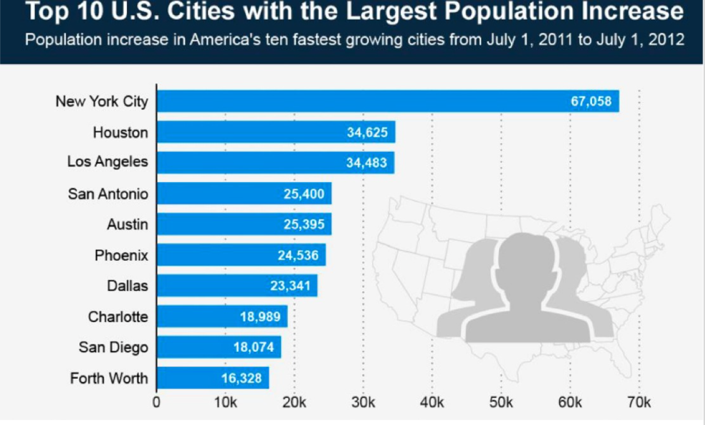

**图像要点：** 横向柱状图，比较 2011 年 7 月至 2012 年 7 月美国人口增长。纽约市最高，为 67,058；休斯敦 34,625、洛杉矶 34,483；沃斯堡最低，为 16,328。

**口语参考答案**

> The bar chart provides information about population growth in ten U.S. cities from July 2011 to July 2012. Overall, it is clear that New York City grew much faster than the other cities. Looking at the details, its population rose by 67,058. In addition, Houston and Los Angeles followed at about 34,600 each. By contrast, Fort Worth had the smallest increase, at 16,328. Overall, the chart shows a wide gap between the leading city and the rest.

### 03. 母女购买书包

**图像要点：** 两张照片展示一位母亲陪女儿挑选书包；女孩试背粉色花纹书包，另一张照片中她背着新书包微笑。

**口语参考答案**

> The images provide information about a mother and daughter shopping for a school backpack. Overall, it is clear that they are having a positive shopping experience. Looking at the details, the mother helps the girl choose a colourful patterned backpack. In addition, the second picture shows the girl wearing it and smiling. Overall, the images show a child preparing for school with her mother's help.

### 04. 加拿大人口增长构成

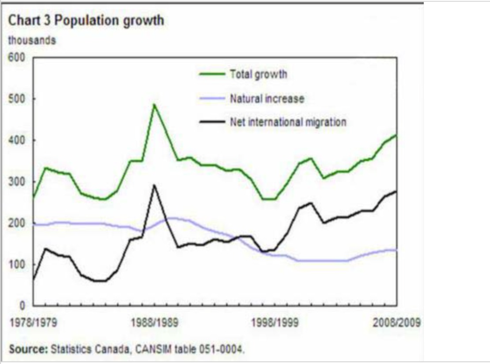

**图像要点：** 折线图显示 1978/79–2008/09 的总增长、自然增长和国际净移民人数，纵轴单位为千人。总增长波动明显，1988/89 左右达到高峰约 480；自然增长缓慢下降；国际净移民起伏较大，后期上升。

**口语参考答案**

> The line graph provides information about population growth in Canada from 1978–79 to 2008–09, in thousands. Overall, it is clear that total growth fluctuated most, while natural increase gradually declined. Looking at the details, total growth peaked at about 480 thousand around 1988–89. In addition, net international migration rose in the later years. By contrast, natural increase ended below its starting level. Overall, the chart shows changing contributions to Canada's population growth.

### 05. 美国养宠物家庭数量

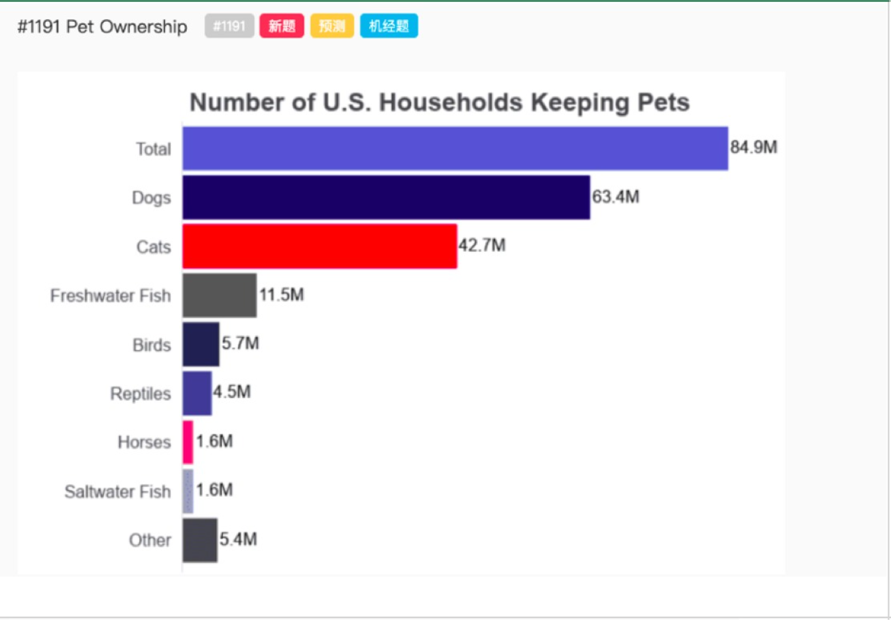

**图像要点：** 横向柱状图显示约 84.9 million 个美国家庭养有宠物。狗最多，为 63.4 million；猫 42.7 million；淡水鱼 11.5 million；其他类别明显更少。

**口语参考答案**

> The bar chart provides information about the number of U.S. households keeping different pets. Overall, it is clear that dogs and cats have the largest figures. Looking at the details, about 63.4 million households keep dogs, compared with 42.7 million for cats. In addition, freshwater fish are a distant third at 11.5 million. By contrast, all other pet categories are much lower. Overall, dogs are the most common pet shown.

### 06. 各地区宠物拥有情况

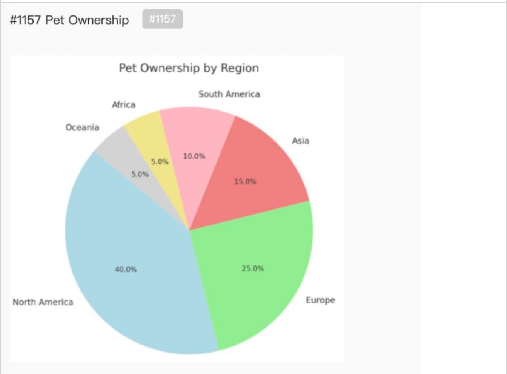

**图像要点：** 饼图显示宠物拥有情况的地区分布：北美 40%，欧洲 25%，亚洲 15%，南美洲 10%，非洲和大洋洲各 5%。

**口语参考答案**

> The pie chart provides information about the regional distribution of pet ownership. Overall, it is clear that North America has the largest share, while Africa and Oceania have the smallest. Looking at the details, North America accounts for 40 percent and Europe for 25 percent. In addition, Asia represents 15 percent and South America 10 percent. By contrast, Africa and Oceania each make up 5 percent. Overall, North America and Europe together account for nearly two thirds.

### 07. 美国家庭拥有的宠物类型

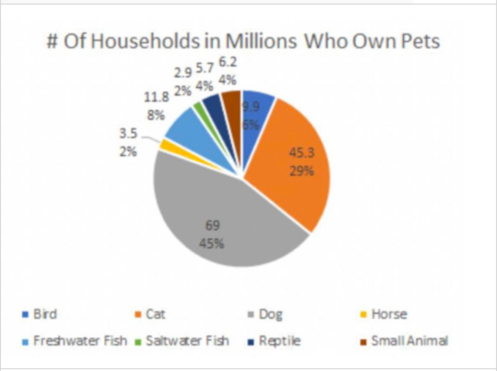

**图像要点：** 饼图以家庭数量（百万）及比例显示宠物类别。狗最多，约 69 million、45%；猫约 45.3 million、29%；其余类别占比较小。

**口语参考答案**

> The pie chart provides information about pets owned by U.S. households. Overall, it is clear that dogs form the largest category, followed by cats. Looking at the details, dogs account for about 69 million households, or 45 percent. In addition, cats represent approximately 45.3 million households, or 29 percent. By contrast, the remaining pet types have much smaller shares. Overall, dogs and cats dominate the chart.

### 08. 美国宠物开支

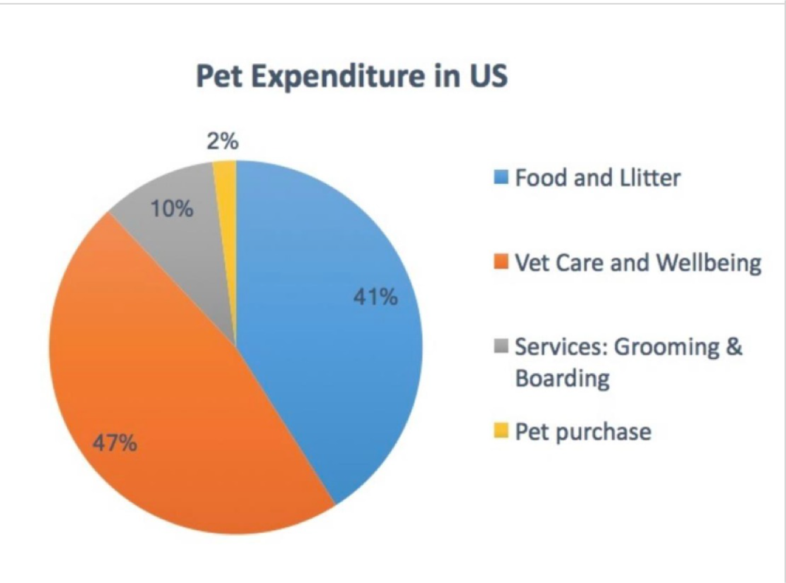

**图像要点：** 饼图显示宠物相关开支：兽医护理和健康 47%，食物及猫砂 41%，美容和寄养服务 10%，购买宠物 2%。

**口语参考答案**

> The pie chart provides information about pet-related spending in the U.S. Overall, it is clear that veterinary care and food make up most of the total. Looking at the details, veterinary care accounts for 47 percent, while food and litter represent 41 percent. In addition, grooming and boarding make up 10 percent. By contrast, buying a pet accounts for only 2 percent. Overall, most spending goes toward ongoing care and supplies.

### 09. 哪些国家的养猫比例较高

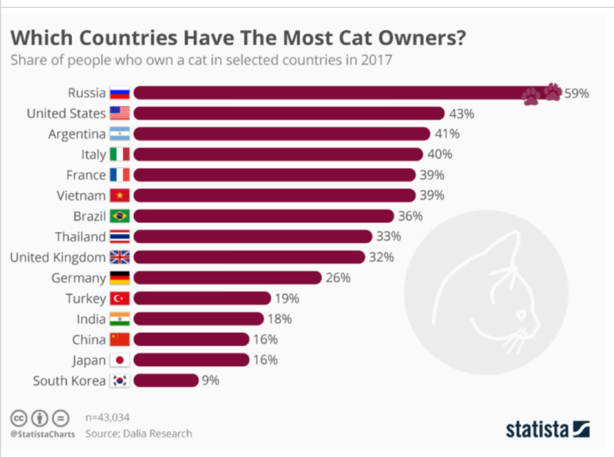

**图像要点：** 2017 年部分国家人口中养猫者的比例。俄罗斯最高，为 59%；美国 43%；阿根廷 41%；意大利 40%；韩国最低，为 9%。

**口语参考答案**

> The bar chart provides information about cat ownership in selected countries in 2017. Overall, it is clear that Russia has the highest share, while South Korea has the lowest. Looking at the details, 59 percent of people in Russia owned a cat. In addition, the figures for the United States, Argentina and Italy were about 43, 41 and 40 percent. By contrast, South Korea stood at only 9 percent. Overall, cat ownership varied widely across the countries shown.

### 10. 成年人较少参观博物馆或美术馆的原因

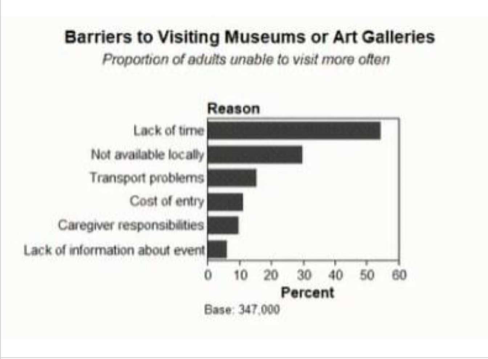

**图像要点：** 横向柱状图；受访者约 347,000 人。缺少时间约 54%，当地没有场馆约 29%，交通问题约 15%，门票费用约 11%，照护责任约 9%，缺少活动信息约 5%。

**口语参考答案**

> The bar chart provides information about why adults visit museums or art galleries less often. Overall, it is clear that lack of time is the main barrier. Looking at the details, about 54 percent cited time, while roughly 29 percent said a venue was not available locally. In addition, transport problems affected around 15 percent. By contrast, cost, caring duties and limited event information were less common reasons. Overall, time was the most significant obstacle.

### 11. 美国成年人手机拥有率

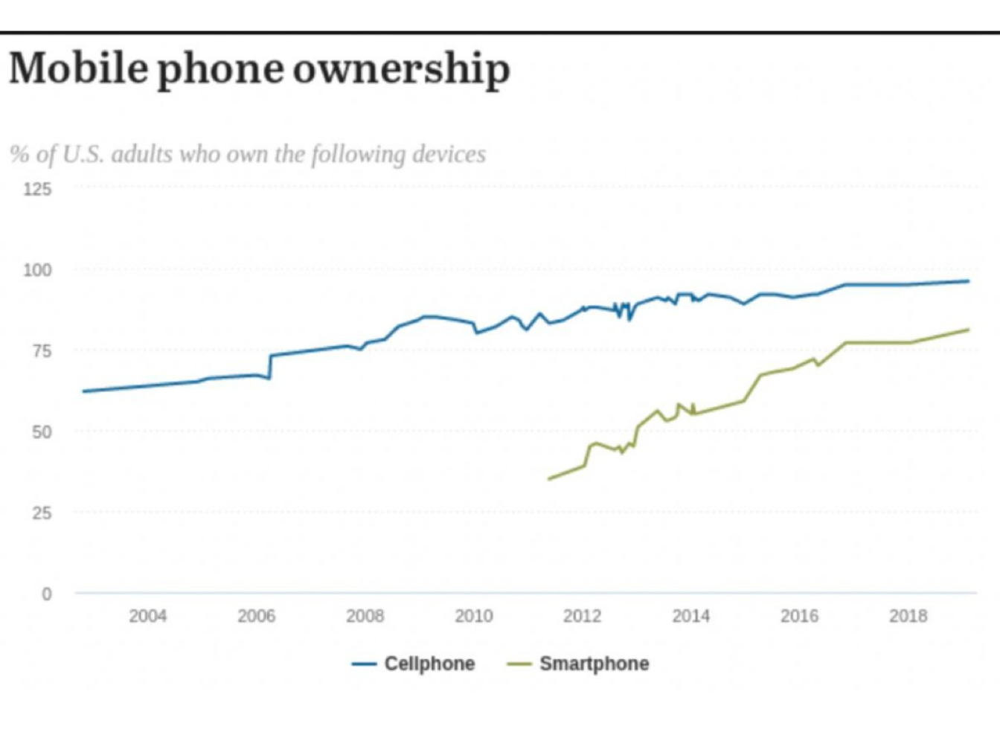

**图像要点：** 折线图展示约 2003–2019 年美国成年人拥有普通手机和智能手机的比例。普通手机从约 63% 上升到约 96%；智能手机自约 2011 年起快速增长，到 2019 年约 82%。

**口语参考答案**

> The line graph provides information about cellphone ownership among U.S. adults from about 2003 to 2019. Overall, it is clear that ownership of any cellphone approached saturation, while smartphone use grew rapidly later. Looking at the details, cellphone ownership rose from about 63 to 96 percent. In addition, smartphones increased from roughly 35 percent in 2011 to about 82 percent in 2019. Overall, smartphones became increasingly common.

### 12. 智能手机的普及

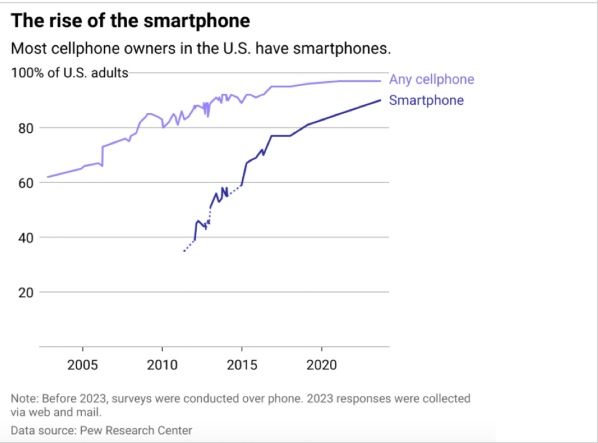

**图像要点：** 折线图比较美国成年人拥有任意手机与智能手机的比例；任意手机比例接近 100%，智能手机由 2011 年前后的约 35% 上升至 2023 年约 90%。

**口语参考答案**

> The line graph provides information about cellphone and smartphone ownership among U.S. adults. Overall, it is clear that almost all adults have a cellphone and smartphone ownership has risen sharply. Looking at the details, any-cellphone ownership increased from about 62 percent in 2004 to nearly 100 percent by 2023. In addition, smartphone ownership rose from roughly 35 percent in 2011 to about 90 percent. Overall, smartphones now account for most cellphone use.

### 13. Anytown 的手机使用人数

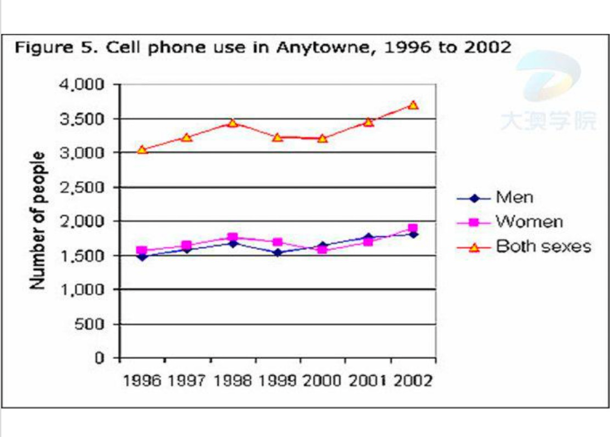

**图像要点：** 折线图比较 1996–2002 年 Anytown 男性、女性及两性合计手机使用人数，纵轴为人数。两性合计从约 3,000 上升到约 3,700；男性和女性各自约在 1,500–1,900 间波动。

**口语参考答案**

> The line graph provides information about cellphone users in Anytown from 1996 to 2002. Overall, it is clear that the combined number increased despite some fluctuations. Looking at the details, the total for men and women rose from about 3,000 to roughly 3,700. In addition, male and female figures followed similar patterns, generally between 1,500 and 1,900. Overall, mobile use trended upward over the period.

### 14. 城市人口比例

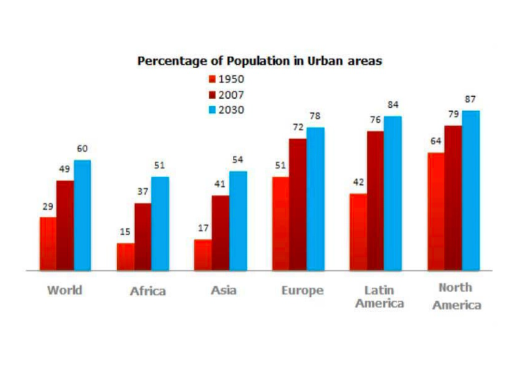

**图像要点：** 柱状图比较 1950、2007 和 2030 年世界及各地区的城市人口比例（2030 为图中预测）：世界 29/49/60%；非洲 15/37/51%；亚洲 17/41/54%；欧洲 51/72/78%；拉丁美洲 42/76/84%；北美 64/79/87%。

**口语参考答案**

> The bar chart provides information about the share of people living in urban areas worldwide and by region in 1950, 2007 and projected 2030. Overall, it is clear that urbanization rises in every region. Looking at the details, the world figure increases from 29 to 49 and then 60 percent. In addition, North America remains the most urbanized region. By contrast, Africa stays lowest, although its share also grows. Overall, urban populations are projected to expand.

### 15. 各国人均巧克力消费量

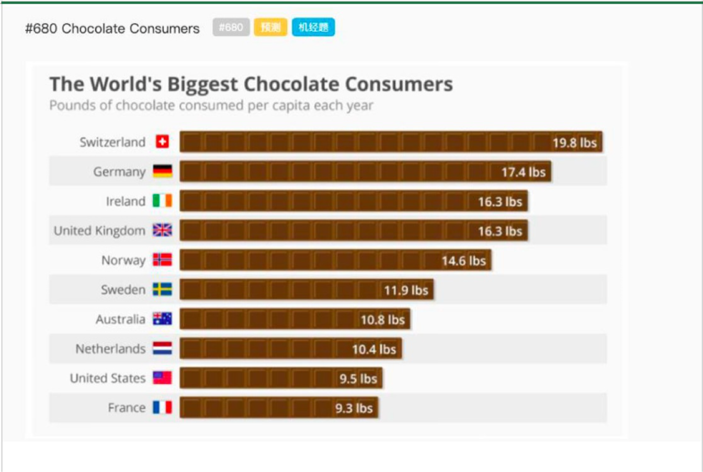

**图像要点：** 横向柱状图显示每人每年巧克力消费磅数。瑞士最高，19.8 磅；德国 17.4；爱尔兰和英国各 16.3；法国最低，为 9.3 磅。

**口语参考答案**

> The bar chart provides information about annual chocolate consumption per person in selected countries. Overall, it is clear that Switzerland ranks highest and France lowest. Looking at the details, Switzerland consumes 19.8 pounds per person, followed by Germany at 17.4. In addition, Ireland and the United Kingdom are tied at 16.3 pounds. By contrast, France records 9.3 pounds. Overall, Swiss consumption is more than twice the French figure.

### 16. 四座城市的平均降雨量

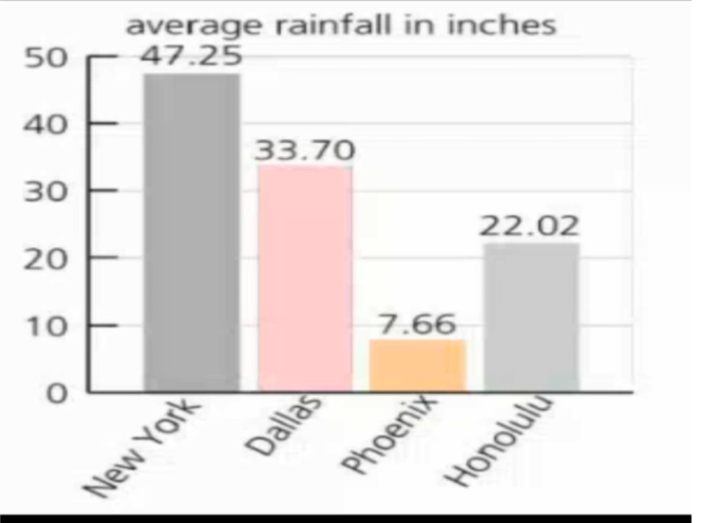

**图像要点：** 柱状图显示 New York 47.25 英寸、Dallas 33.70、Honolulu 22.02、Phoenix 7.66。

**口语参考答案**

> The bar chart provides information about average rainfall in four cities, measured in inches. Overall, it is clear that New York receives the most rainfall and Phoenix the least. Looking at the details, New York records 47.25 inches, followed by Dallas at 33.70. In addition, Honolulu receives 22.02 inches. By contrast, Phoenix has only 7.66 inches. Overall, New York's average is over six times Phoenix's.

### 17. 2007 年欧盟国家人口构成

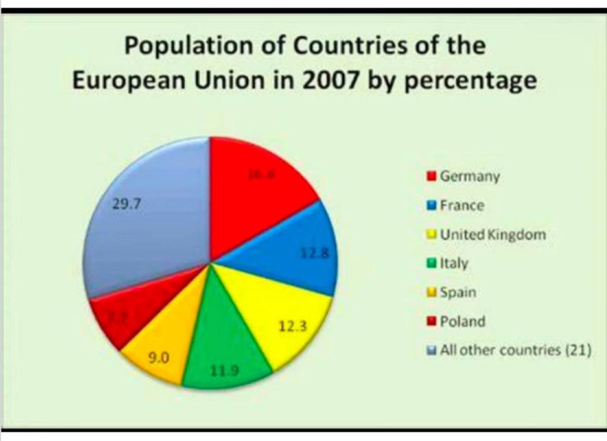

**图像要点：** 饼图显示欧盟成员国人口比例：德国 16.6%，法国 12.8%，英国 12.3%，意大利 11.9%，西班牙 9.0%，波兰约 7.7%，其余 21 个国家合计 29.7%。

**口语参考答案**

> The pie chart provides information about the population shares of European Union countries in 2007. Overall, it is clear that Germany has the largest individual share, while the other 21 countries form the largest combined segment. Looking at the details, Germany accounts for 16.6 percent. In addition, France, the U.K. and Italy represent 12.8, 12.3 and 11.9 percent. By contrast, Spain and Poland are lower. Overall, the population is spread across many member states.

### 18. 不同工作状态与收入的散点图

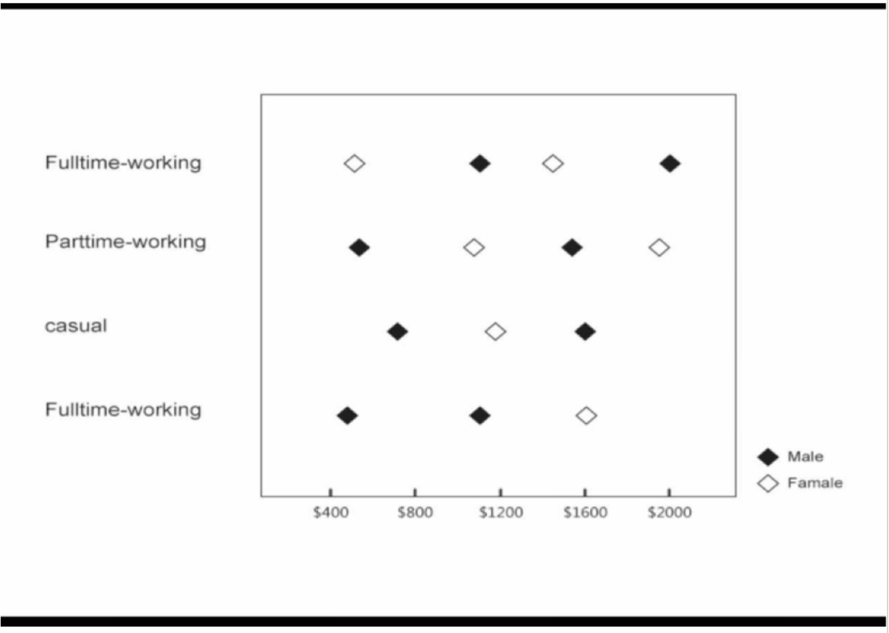

**图像要点：** 散点图以美元金额（约 $400–$2,000）和工作状态比较男女数据点。图中可辨认全职、兼职、casual 等类别，但“Fulltime-working”标签出现两次，缺少清晰图题及纵轴说明。

**口语参考答案**

> The scatter plot provides information about male and female figures across several work arrangements, with dollar amounts on the horizontal scale. Overall, it is clear that the points are spread across roughly 400 to 2,000 dollars. Looking at the details, some of the highest values appear in the full-time rows. In addition, part-time and casual entries appear at lower or middle amounts. The vertical measure is not clearly labelled, so the safest summary is the distribution of points across the categories.

### 19. 农贸市场场景

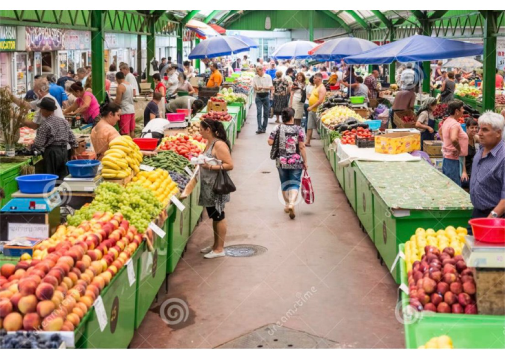

**图像要点：** 照片展示一个繁忙的露天/有顶市场；摊位陈列水果和蔬菜，顾客在通道中购物，摊位上方有遮阳伞。

**口语参考答案**

> The image provides information about a busy fresh-produce market. Overall, it is clear that shoppers move through a lively market with stalls on both sides. Looking at the details, the displays contain a wide range of fruits and vegetables. In addition, several umbrellas cover the stalls and people shop along the central aisle. Overall, the photograph shows a well-stocked market with many customers.

### 20. 安大略省通勤时间（2016）

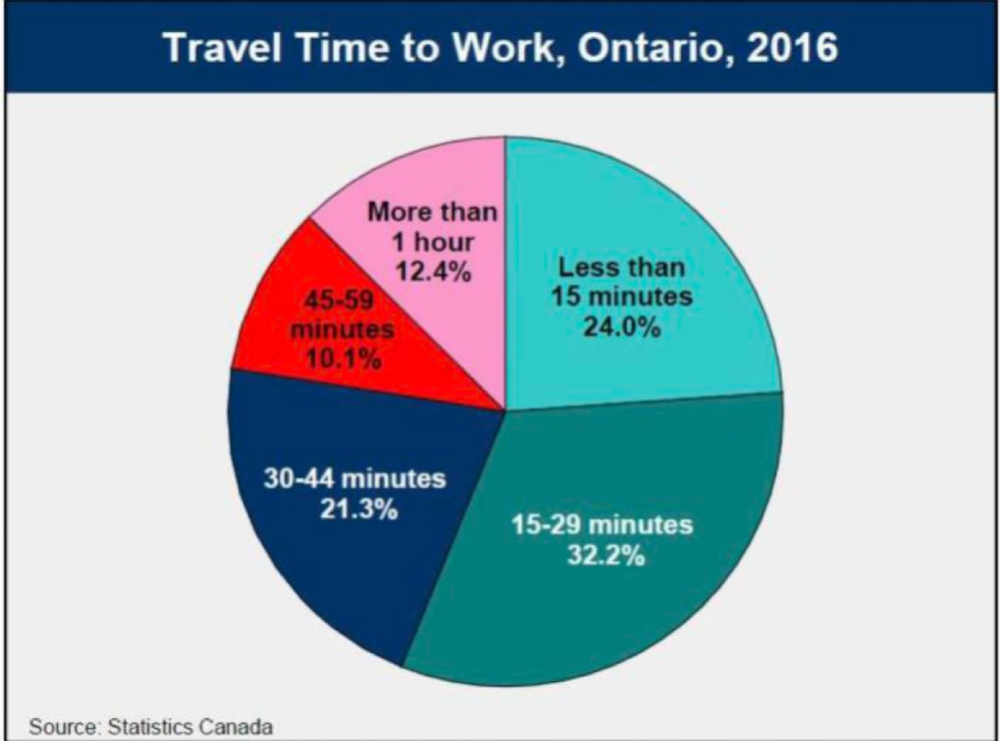

**图像要点：** 饼图显示通勤时间比例：少于 15 分钟 24.0%；15–29 分钟 32.2%；30–44 分钟 21.3%；45–59 分钟 10.1%；超过 1 小时 12.4%。

**口语参考答案**

> The pie chart provides information about travel time to work in Ontario in 2016. Overall, it is clear that most commutes take less than 45 minutes. Looking at the details, the largest group, 32.2 percent, travels for 15 to 29 minutes. In addition, 24 percent take under 15 minutes and 21.3 percent take 30 to 44 minutes. By contrast, only 10.1 percent commute for 45 to 59 minutes. Overall, shorter commutes are more common.

### 21. 建筑平面图：主厅与配套设施

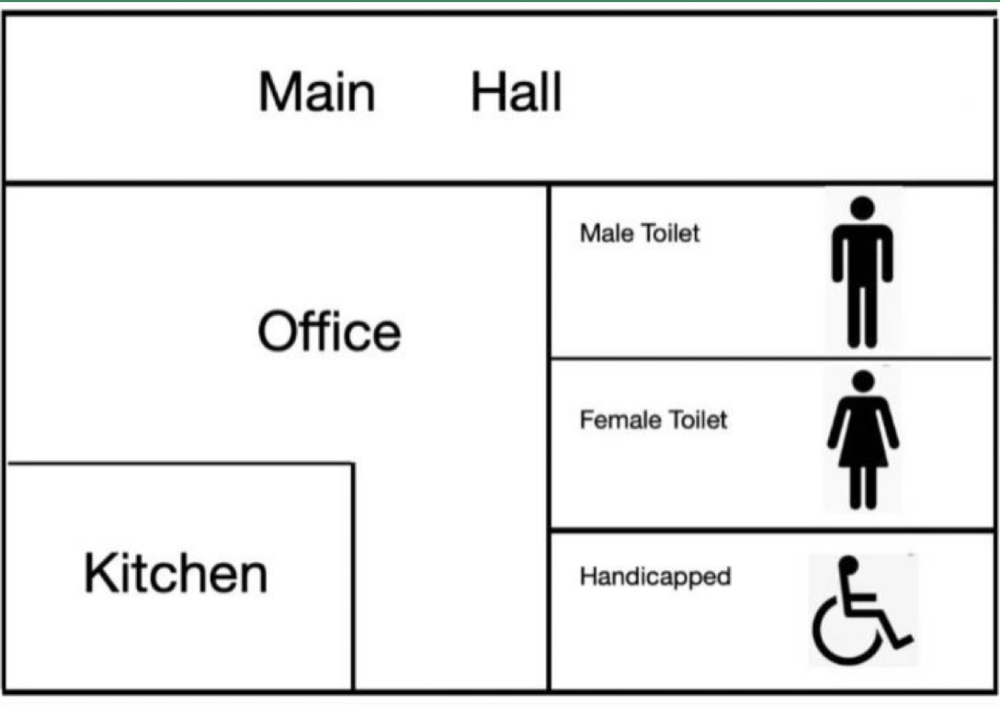

**图像要点：** 平面图显示上方为主厅；左侧是办公室，左下角为厨房；右侧从上到下设有男厕、女厕和无障碍卫生间。各功能区域分布清楚。

**口语参考答案**

> The floor plan provides information about a building's layout. Overall, it is clear that a large main hall occupies the upper area, with support rooms arranged around it. Looking at the details, an office is on the left and a kitchen is in the lower-left corner. In addition, male, female and accessible toilets are placed along the right side. Overall, the plan shows clearly separated public and support areas.

### 22. 食品准备与储存

**图像要点：** 四幅图片分别展示洗手、处理生肉、在烤箱中烹饪食物，以及把食品存放在冰箱里。

**口语参考答案**

> The four pictures provide information about preparing and storing food. Overall, it is clear that the sequence moves from hygiene to cooking and refrigeration. Looking at the details, a person first washes their hands and then prepares raw meat separately. In addition, the food is cooked in an oven. Finally, ingredients are chilled in a refrigerator. Overall, the images highlight basic steps for safe food handling.

### 23. 超市新鲜农产品区

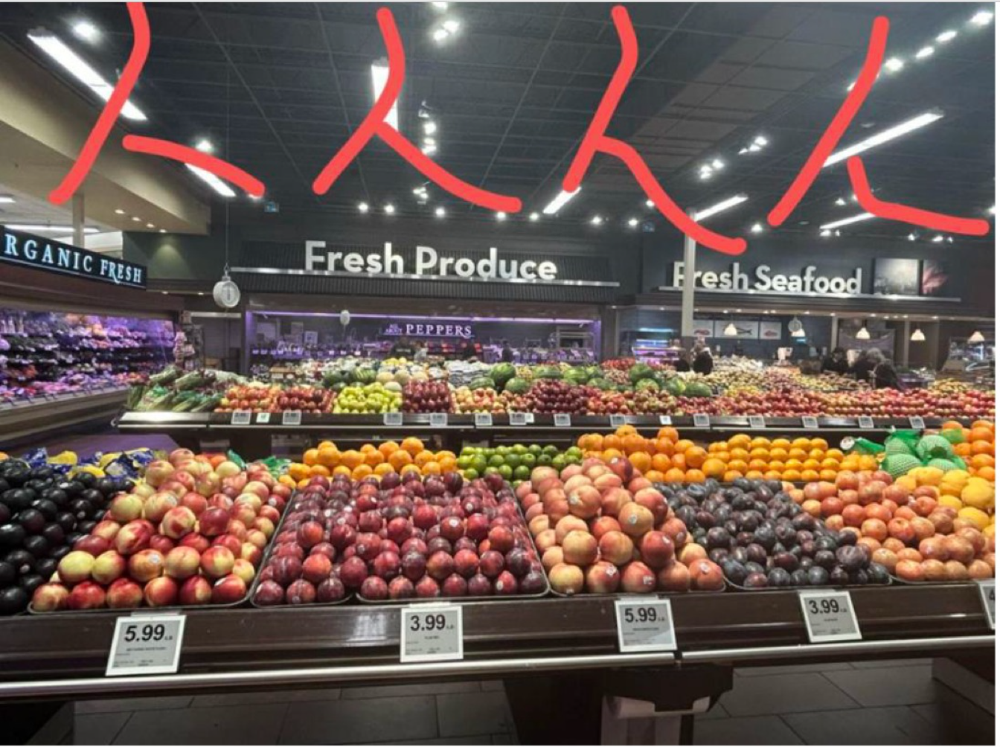

**图像要点：** 照片展示超市 Fresh Produce 区，前景有多排水果和蔬菜，能看到 3.99 和 5.99 等价格牌；后方为更多农产品及 Fresh Seafood 区域。

**口语参考答案**

> The photograph provides information about the fresh-produce section of a supermarket. Overall, it is clear that a wide variety of fruit and vegetables is arranged for shoppers. Looking at the details, the items are displayed in neat rows with price labels such as 3.99 and 5.99. In addition, more produce and a seafood section appear in the background. Overall, the display looks colourful and organized.

### 24. 每周家庭开支

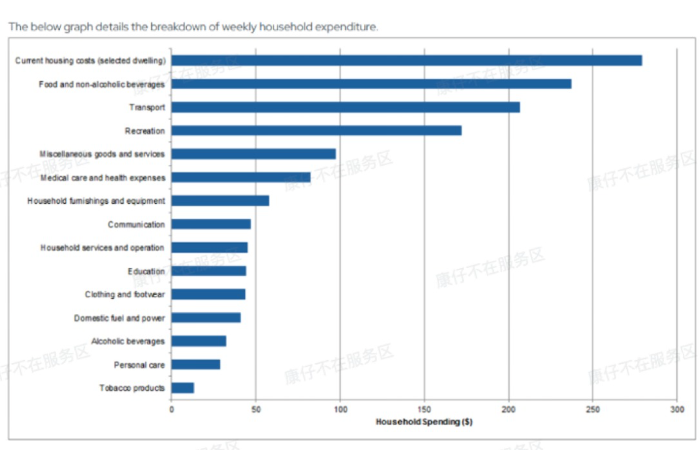

**图像要点：** 横向柱状图显示每周家庭开支类别。住房费用最高（约 $280），其次为食品和非酒精饮料（约 $240）、交通（约 $210）和娱乐（约 $170）；烟草产品最低（约 $12）。

**口语参考答案**

> The bar chart provides information about weekly household spending in Australia. Overall, it is clear that housing is the largest expense, while tobacco is the smallest. Looking at the details, housing costs are about 280 dollars and food and non-alcoholic drinks about 240. In addition, transport and recreation account for roughly 210 and 170 dollars. By contrast, tobacco products are around 12 dollars. Overall, spending varies widely by category.

### 25. 斯洛伐克消费者食品、饮料和烟草支出占比

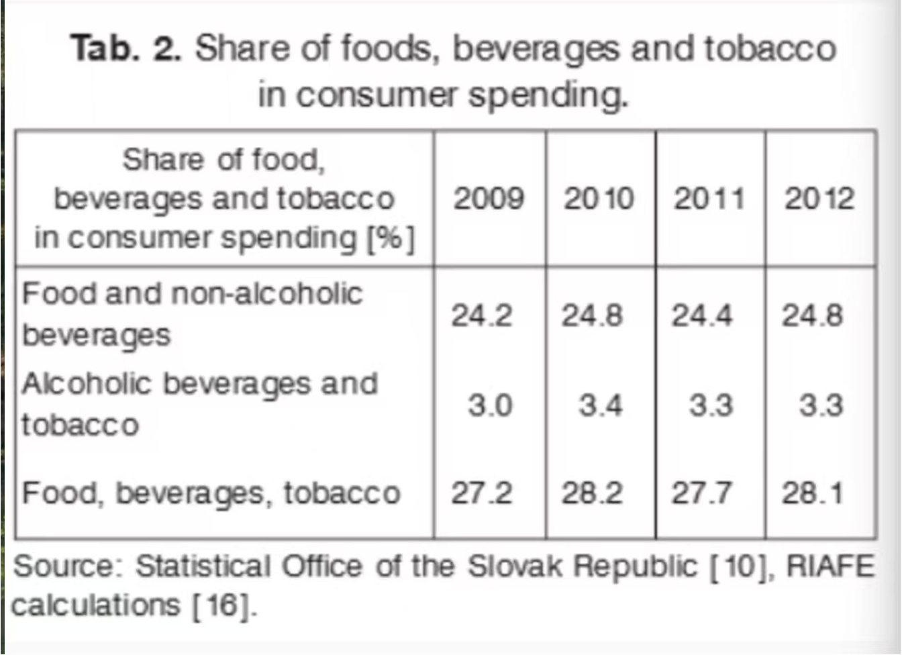

**图像要点：** 表格比较 2009–2012 年支出占比：食品及非酒精饮料为 24.2%、24.8%、24.4%、24.8%；酒精饮料及烟草为 3.0%、3.4%、3.3%、3.3%；合计为 27.2%、28.2%、27.7%、28.1%。

**口语参考答案**

> The table provides information about consumer spending on food, beverages and tobacco in Slovakia from 2009 to 2012. Overall, it is clear that food and non-alcoholic drinks account for most of the combined share. Looking at the details, this category stays around 24 to 25 percent, while alcohol and tobacco make up just over 3 percent. In addition, the combined figure peaks at 28.2 percent in 2010. Overall, the values change only slightly.

### 26. 不同运动项目的男女参与人数

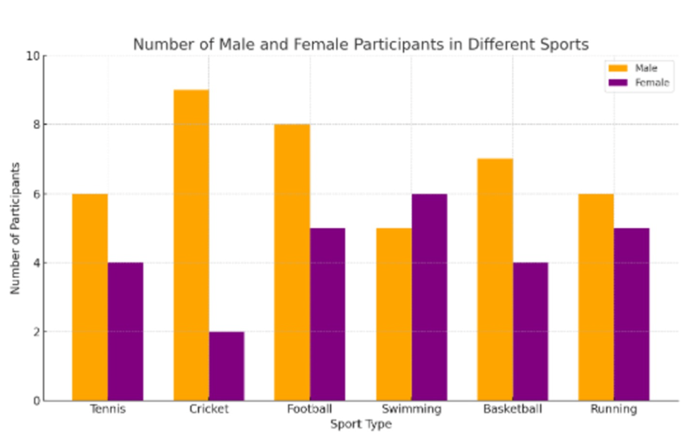

**图像要点：** 分组柱状图比较六种运动的男性/女性参与人数：网球 6/4，板球 9/2，足球 8/5，游泳 5/6，篮球 7/4，跑步 6/5。

**口语参考答案**

> The bar chart provides information about male and female participation in six sports. Overall, it is clear that men have higher figures in most sports, while women lead in swimming. Looking at the details, cricket shows the largest gap, with nine male and two female participants. In addition, men also lead in tennis, football, basketball and running. By contrast, women record six participants in swimming, compared with five men. Overall, participation differs by sport.

### 27. 本科毕业生平均工资

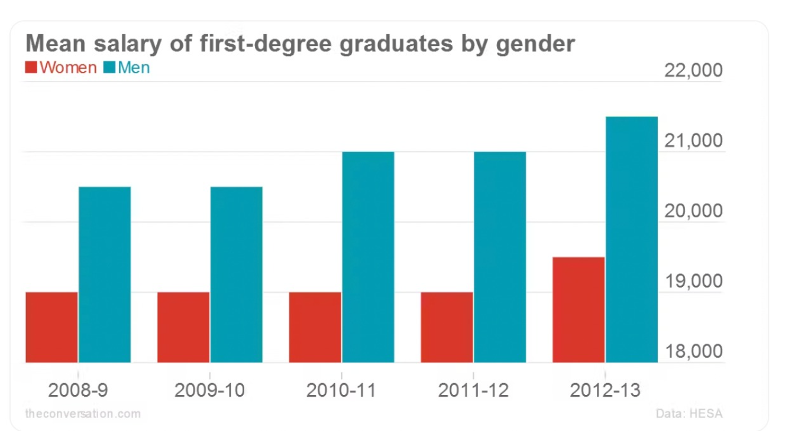

**图像要点：** 柱状图比较 2008–09 至 2012–13 年不同性别本科毕业生的平均工资。男性平均工资每年都高于女性；男性大约从 $20,400 上升到 $21,500，女性约从 $18,900 上升到 $19,400。

**口语参考答案**

> The bar chart provides information about mean salaries for male and female first-degree graduates from 2008–09 to 2012–13. Overall, it is clear that men earn more in every year shown. Looking at the details, male salaries rise from about 20,400 to 21,500 dollars. In addition, women's figures remain near 18,900 at first and reach about 19,400. Overall, both rise slightly, but a gender pay gap remains.

### 28. Population growth and growth in the rating base (PTE Core Practice #1)

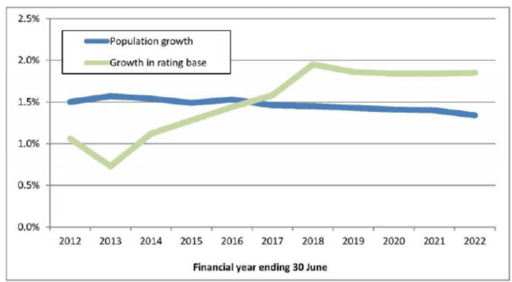

**图像要点：** 折线图比较 2012–2022 财年的人口增长率与 rating base 增长率。人口增长率大致从 1.5% 缓慢降至 1.35%；rating base 增长率 2013 年降至约 0.7%，2018 年升至约 1.95%，此后稳定在约 1.8% 左右。

**口语参考答案**

> The line graph provides information about population growth and growth in the rating base from 2012 to 2022. Overall, population growth stayed fairly stable and then declined slightly, while the second measure rose sharply. Looking at the details, population growth fell from about 1.5 to 1.35 percent. In addition, rating-base growth dipped to roughly 0.7 percent in 2013 before peaking near 2 percent in 2018. Overall, the two measures followed different trends.

### 29. Canada inbound tourism recovery (PTE Core Practice #18)

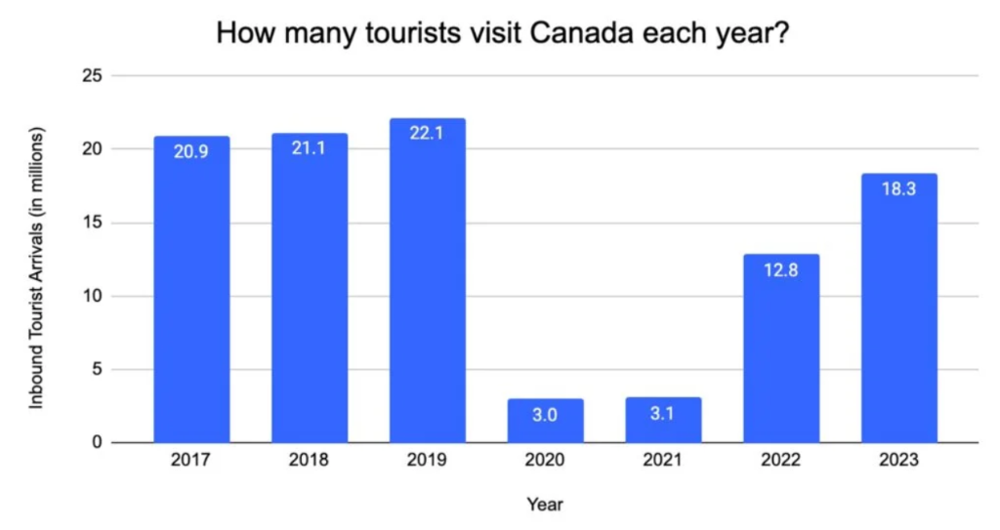

**图像要点：** 柱状图显示 2017–2023 年加拿大入境游客人数（百万）：20.9、21.1、22.1、3.0、3.1、12.8、18.3。2020 年骤降，之后持续回升。

**口语参考答案**

> The bar chart provides information about inbound tourist arrivals to Canada from 2017 to 2023, in millions. Overall, arrivals fell sharply in 2020 and then recovered, although they remained below the 2019 peak. Looking at the details, the figure rose slightly from 20.9 million in 2017 to 22.1 million in 2019. In addition, it dropped to about 3 million in 2020 and 2021. By contrast, arrivals rebounded to 18.3 million by 2023. Overall, tourism showed a strong recovery.

### 30. Tree life cycle (PTE Core Practice #21)

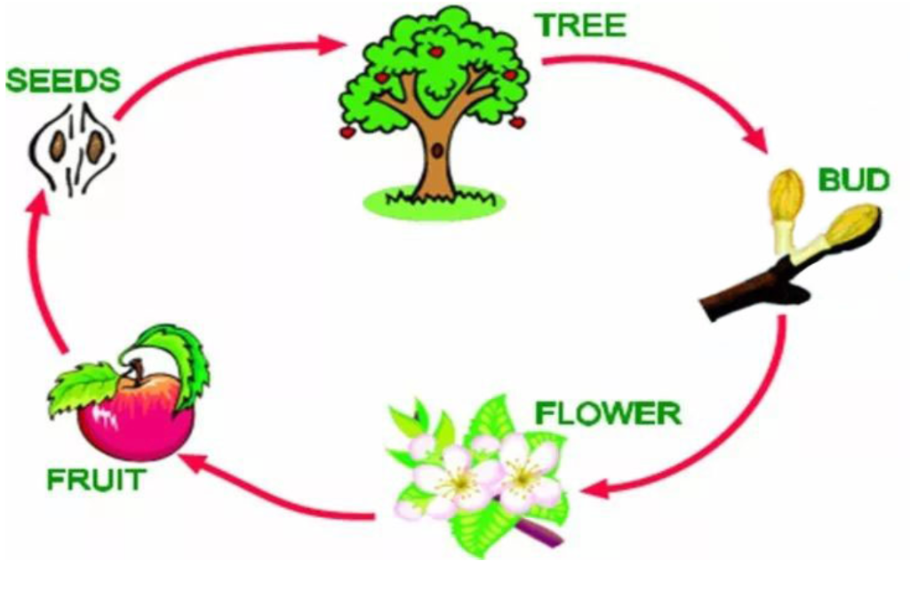

**图像要点：** 循环图依次显示 seeds、tree、bud、flower、fruit，再回到 seeds，呈现树木的生长与繁殖周期。

**口语参考答案**

> The diagram provides information about the life cycle of a tree. Overall, it is clear that the process is circular, beginning with seeds and producing new seeds at the end. Looking at the details, a seed grows into a tree, which develops buds and flowers. In addition, the flowers mature into fruit containing seeds. These seeds can then start the cycle again. Overall, the diagram shows a continuous cycle of plant growth.

### 31. Journeys by men and women in the U.K. (PTE Core Practice #22)

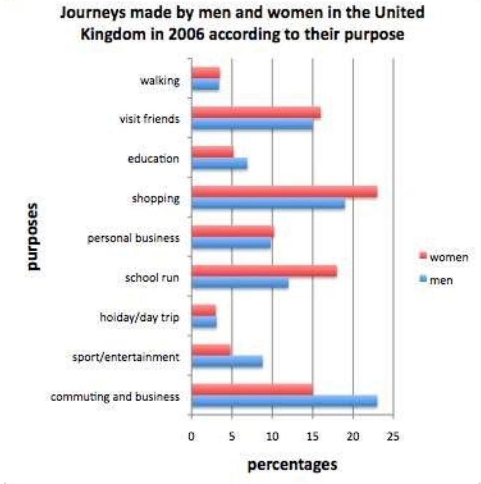

**图像要点：** 分组横向柱状图比较 2006 年英国男女出行目的。女性购物约 23%、接送孩子约 18%；男性通勤及商务约 23%。男性在体育娱乐、教育等项目偏高，女性购物和 school run 偏高。

**口语参考答案**

> The bar chart compares journey purposes for men and women in the U.K. in 2006. Overall, women record higher figures for shopping and school runs, while men lead in commuting and business. Looking at the details, shopping is about 23 percent for women and 19 percent for men. In addition, men's commuting and business figure is roughly 23 percent, compared with 15 percent for women. By contrast, women are also higher for school runs. Overall, travel purposes vary by gender.

### 32. Dog and cat expenditure by age group in Australia (PTE Core Practice #24)

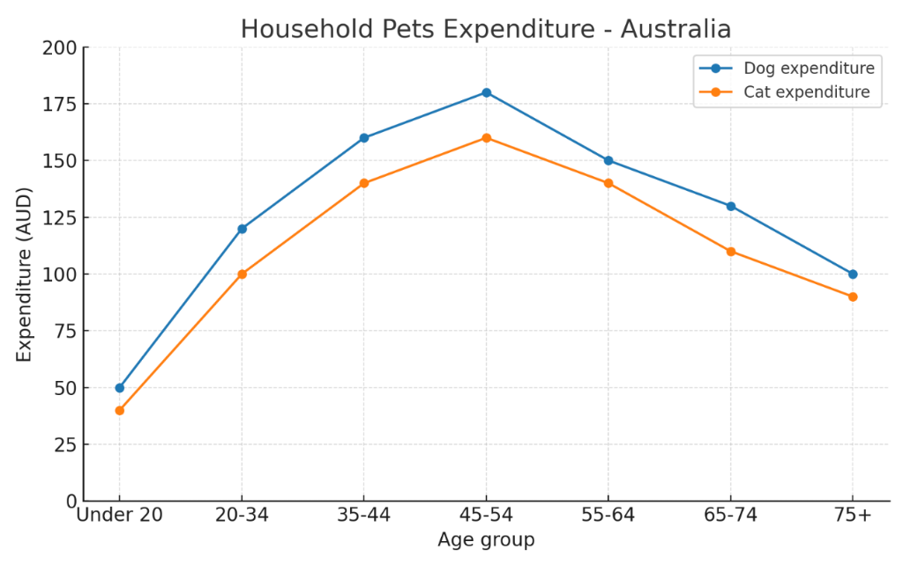

**图像要点：** 折线图比较澳大利亚不同年龄组的狗、猫支出（澳元）。两条线均在 45–54 岁组达到峰值，狗支出约 180 澳元、猫约 160 澳元；之后随年龄增加而下降，狗支出始终较高。

**口语参考答案**

> The line graph provides information about dog and cat expenditure across age groups in Australia. Overall, both figures peak among people aged 45 to 54, and dog spending is higher in every group. Looking at the details, spending reaches about 180 Australian dollars for dogs and 160 for cats at the peak. In addition, both amounts decline among older groups. By contrast, the under-20 group records the lowest figures. Overall, expenditure follows a similar age pattern for both pets.

### 33. Ontario manufacturing employment and the Canadian dollar (PTE Core Practice #25)

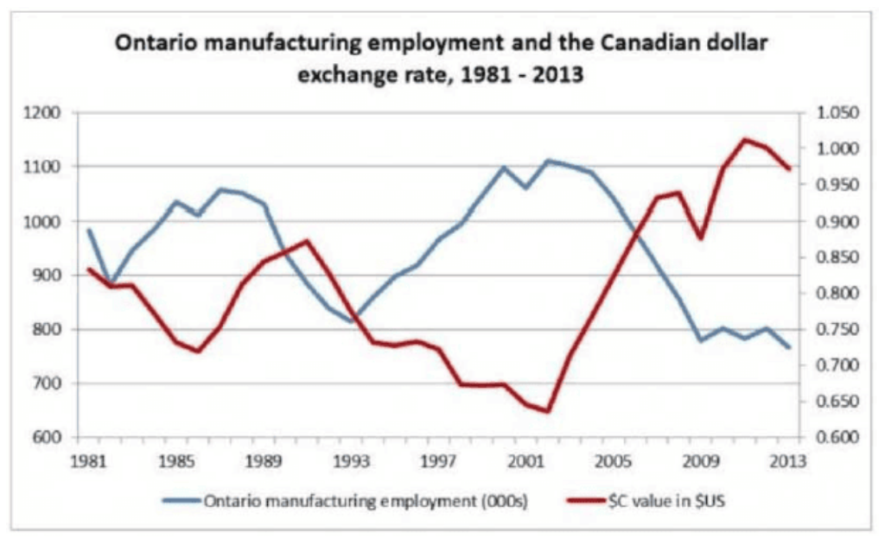

**图像要点：** 折线图比较 1981–2013 年安大略制造业就业人数（千人）与加元兑美元汇率。就业人数波动后在 2001 年左右达到约 110 万，之后下降至约 77 万；汇率在 2002 年前后降至约 0.65 美元，之后升至接近或高于 1 美元。

**口语参考答案**

> The line graph compares Ontario manufacturing employment and the Canadian dollar exchange rate from 1981 to 2013. Overall, employment fluctuated before declining, while the exchange rate fell and then rose. Looking at the details, manufacturing employment peaked at about 1.1 million around 2001 and dropped to roughly 770,000 by 2013. In addition, the exchange rate reached a low near 0.65 U.S. dollars before recovering to around parity. Overall, the two measures followed different patterns.

### 34. U.S. population growth across three decades (PTE Core Practice #26)

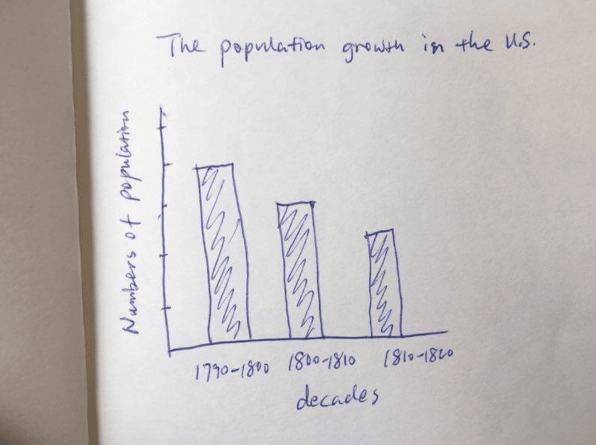

**图像要点：** 手绘柱状图比较 1770–1780、1800–1810、1810–1820 三个时期的美国人口增长。第一时期最高，之后两柱逐步变低；图中没有清晰的纵轴刻度或具体数值。

**口语参考答案**

> The hand-drawn bar chart provides information about U.S. population growth across three decades. Overall, it is clear that the bars become shorter from the first period to the third. Looking at the details, 1770 to 1780 has the highest bar, followed by 1800 to 1810. In addition, 1810 to 1820 shows the lowest bar. The chart has no clear numerical scale, so exact values are unavailable. Overall, it suggests a declining pattern across the periods shown.

### 35. Customers at a coffee shop (PTE Core Practice #28)

**图像要点：** 照片展示咖啡店柜台，一名店员在收银或准备饮品，几位顾客排队等候；背景可见咖啡设备和柜台陈设。

**口语参考答案**

> The image shows a scene at a coffee shop counter. Overall, it is clear that staff are serving several customers. Looking at the details, a woman behind the counter appears to prepare a drink or handle an order. In addition, a group of customers waits along the other side of the counter. Coffee equipment and shelves are visible in the background. Overall, the photograph shows a busy customer-service setting.

### 36. Common coffee drinks in Australia (PTE Core Practice #30)

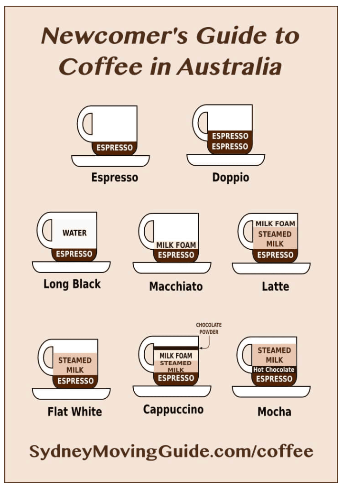

**图像要点：** 信息图介绍 Espresso、Doppio、Long Black、Macchiato、Latte、Flat White、Cappuccino 和 Mocha 等咖啡饮品，并以浓缩咖啡、水、蒸奶、奶泡及巧克力粉说明组成差异。

**口语参考答案**

> The infographic provides information about common coffee drinks in Australia. Overall, it is clear that espresso is the base for all the varieties, with other ingredients creating different drinks. Looking at the details, a doppio uses two espresso shots, while a long black adds water. In addition, a latte and flat white include steamed milk, and a cappuccino contains milk foam. By contrast, a mocha also includes chocolate. Overall, the image compares several familiar coffee preparations.

### 37. Projected population of Australia (PTE Core Practice #32)

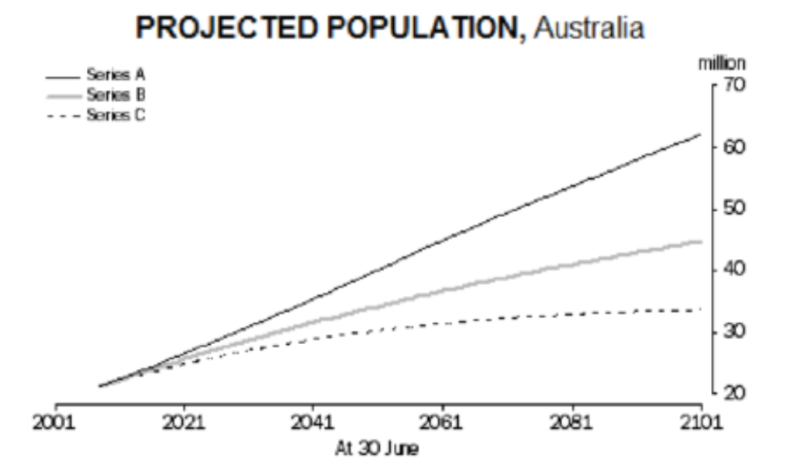

**图像要点：** 折线图展示 2001–2101 年澳大利亚人口的三种预测序列，单位为百万。三条线都上升；2101 年 Series A 约 62 百万、Series B 约 45 百万、Series C 约 34 百万。图中未解释各序列代表的情景。

**口语参考答案**

> The line graph provides three projections of Australia's population from 2001 to 2101, in millions. Overall, all three series rise, with Series A increasing the most. Looking at the details, the population begins at around 20 million. In addition, by 2101 Series A reaches about 62 million, while Series B is near 45 million and Series C around 34 million. Overall, each projection shows long-term population growth, but at a different rate.

### 38. Overseas visitors to Canada by country (PTE Core Practice #36)

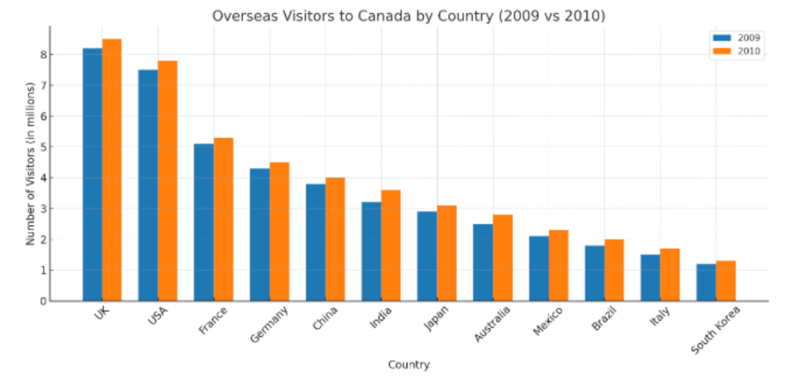

**图像要点：** 分组柱状图比较 2009 和 2010 年来自 12 个国家/地区的加拿大海外游客人数（百万）。英国与美国人数最多，韩国最少；每个来源地的 2010 年数值都略高于 2009 年。

**口语参考答案**

> The bar chart compares overseas visitors to Canada by country in 2009 and 2010, in millions. Overall, the U.K. and the U.S. are the largest sources, while South Korea is the smallest, and every country shows a slight increase. Looking at the details, the U.K. records about 8.5 million visitors in 2010, followed by the U.S. at roughly 7.8 million. In addition, France and Germany are around 5.3 and 4.5 million. Overall, arrivals are concentrated in the leading countries.

### 去重记录：未重复录入的 PTE Core Practice 题目

| 网站题号 | 对应本地题目 | 判定依据 |
| --- | --- | --- |
| 2 | 16 | 四城市平均降雨量 |
| 3 | 10 | 成年人较少参观博物馆/美术馆的原因 |
| 4 | 19 | 农贸市场照片 |
| 5、13 | 1 | 咖啡制作流程 |
| 6 | 2 | 美国城市人口增长 |
| 7 | 3 | 母女挑选书包 |
| 8 | 15 | 各国人均巧克力消费 |
| 9 | 6 | 宠物拥有地区分布 |
| 10 | 5 | 美国养宠物家庭数量 |
| 11 | 12 | 美国成年人手机/智能手机普及 |
| 12 | 20 | 安大略通勤时间 |
| 14 | 9 | 2017 年各国养猫比例 |
| 15 | 24 | 家庭按类别支出 |
| 16、20 | 7 | 美国宠物类型及占比，图表版本略有差异 |
| 17 | 22 | 食品准备与储存 |
| 19 | 25 | 斯洛伐克消费者支出表 |
| 23 | 26 | 男女不同运动项目参与人数 |
| 27 | 4 | 加拿大人口增长构成 |
| 29 | 17 | 2007 年欧盟人口构成 |
| 31 | 8 | 宠物开支构成 |
| 33 | 24 | 家庭按类别支出构成 |
| 34 | 18 | 工作状态与收入散点图 |
| 35 | 27 | 本科毕业生男女平均工资 |

## 三、复习建议

- 图表题优先说清 **主题、单位、总体趋势、最高/最低和一组比较**，不必逐项报数。
- 流程图用顺序词：**First / Next / Then / After that / Finally**。
- 照片题描述可见内容：**foreground / background / on the left / on the right / people are…**，不猜人物身份或原因。
- 先练每题的“总览句 + 两条关键细节”；熟悉后再扩展到完整答案。样例中的数值如写明 about/roughly，代表根据图像刻度估读。
